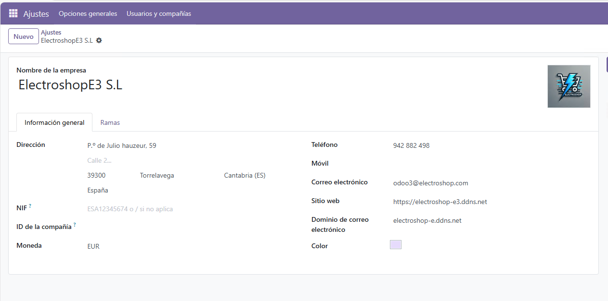
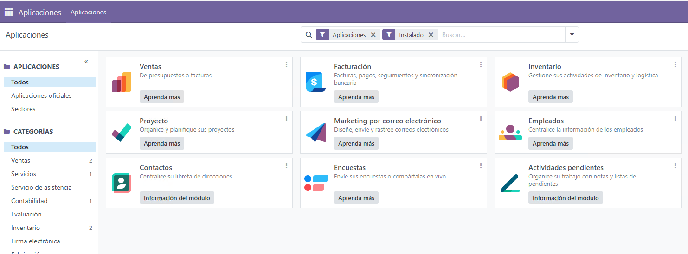

# Configuración de Odoo

## 1. Configuración de la empresa  
Cambiamos la información de nuestra empresa en Odoo desde la pestaña de configuración general.  

## 2. Configuración de idiomas  
- Añadimos los idiomas necesarios o solicitados para la empresa desde la misma pestaña.  

- Comprobamos que se hayan añadido los idiomas correctamente.  

## 3. Instalación de módulos  
Instalamos los módulos necesarios para el correcto funcionamiento del sistema.  

