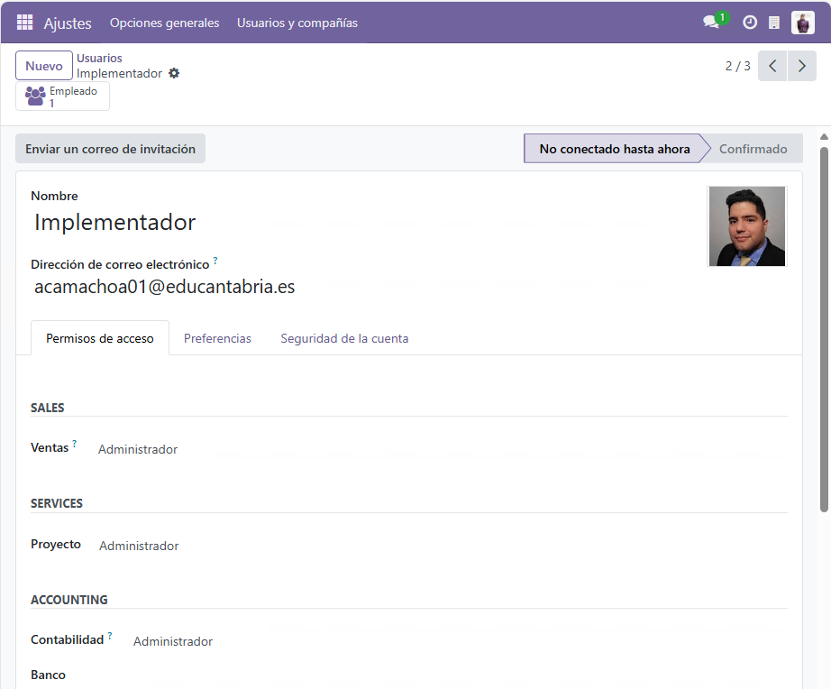
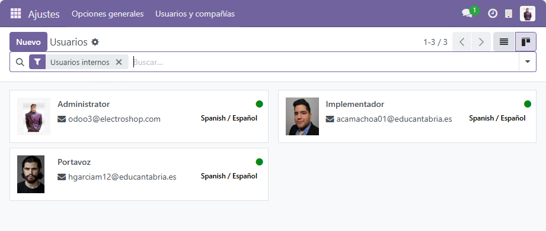
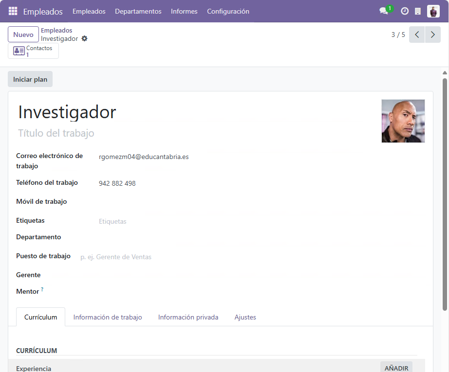
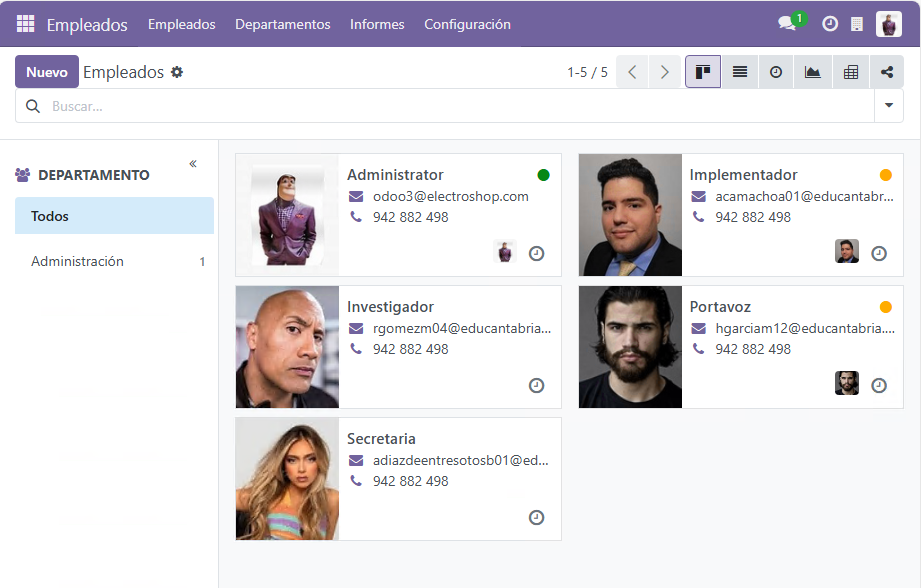
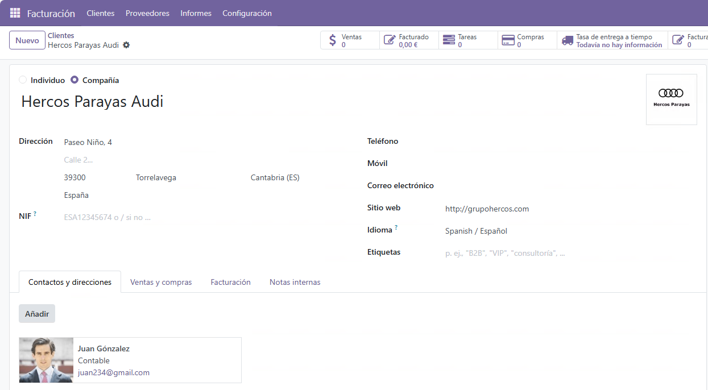
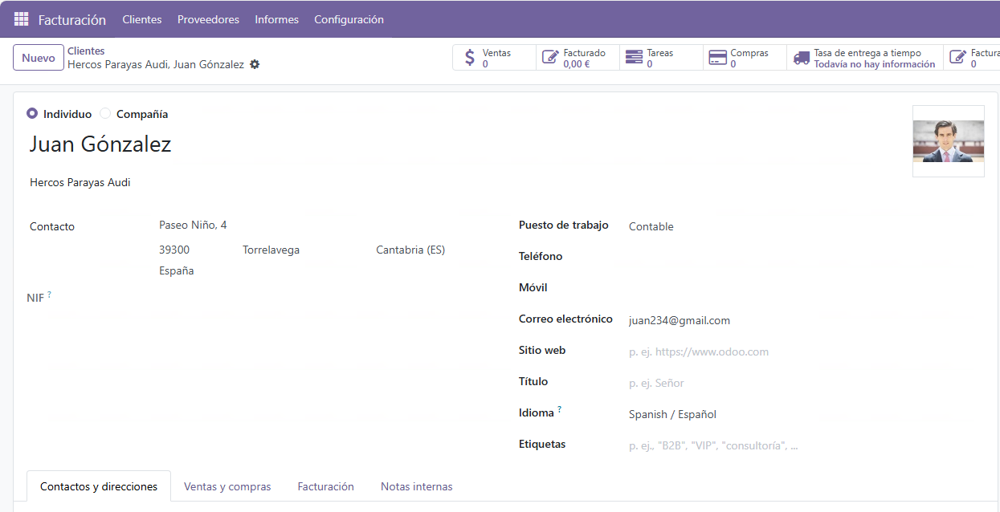
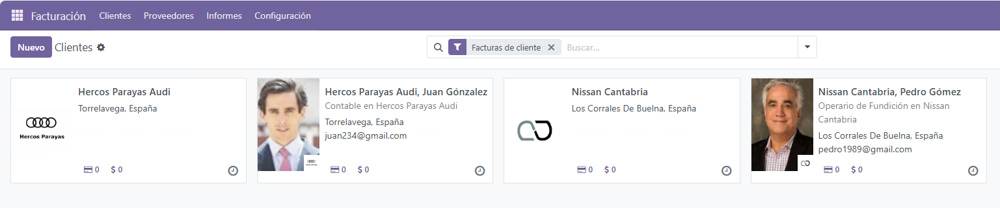
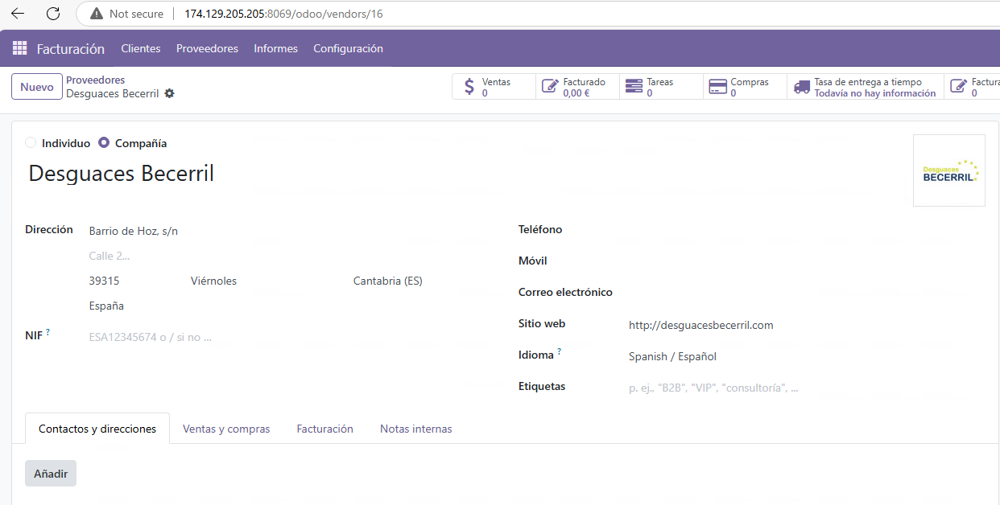
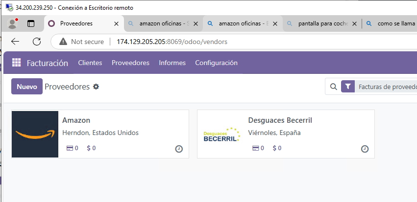

# Creación de Usuarios en Odoo

## Introducción
En Odoo, los usuarios son esenciales para gestionar las operaciones dentro del ERP. Algunos empleados pueden ser usuarios del sistema, mientras que otros solo estarán registrados como empleados sin acceso directo a la plataforma.

## 1. Creación de Usuarios del sistema de Odoo
Para añadir un usuario en Odoo, sigue estos pasos:

1. **Acceder a la Configuración de Usuarios**
   - Ve a **Configuración** > **Usuarios y Empresas** > **Usuarios**.
   - Haz clic en el botón **Crear**.

2. **Introducir los datos del usuario**
   - **Nombre:** Nombre completo del usuario.
   - **Correo Electrónico:** Dirección de email con la que iniciará sesión.
   - **Permisos:** Selecciona el nivel de acceso según su rol dentro de la empresa.
   - **Contraseña:** Se enviará un correo para que el usuario establezca su contraseña.

3. **Asignación de Roles**
   - Los usuarios pueden tener diferentes roles dentro del sistema, por ejemplo:
     - **Administrador**: Acceso total a la configuración y gestión.
     - **Usuario de Ventas**: Acceso solo a módulos de ventas.
     - **Usuario de Inventario**: Acceso limitado a la gestión de almacenes.
     - Creacion y configuracion de uno de los usuarios.
      

     - Te muestro todos los usuarios.
      

## 2. Creación de Empleados
Además de los usuarios, también debemos registrar empleados en la empresa:

1. **Acceder al módulo de Empleados**
   - Dirígete a **Aplicaciones** > **Empleados**.
   - Haz clic en **Crear**.

2. **Rellenar la Información del Empleado**
   - **Nombre:** Nombre completo del empleado.
   - **Departamento:** Asignar el departamento correspondiente (Ejemplo: Informática, Ventas, etc.).
   - **Cargo:** Definir su puesto de trabajo.
   - **Usuario Asociado:** Si el empleado tiene acceso a Odoo, asóciale una cuenta de usuario.
   - Creacion y configuracion de uno de los empleados.
    

   - Te muestro todos los empleados.
    

## 3. Creación de Clientes "2 compañias, 2 individuos" y  2 Proveedores
Además de los empleados, Odoo permite registrar clientes y proveedores:

1. **Crear un Cliente**
   - Ve a **Contactos** > **Clientes** > **Crear**.
   - Introduce los datos del cliente (nombre, dirección, teléfono, email).
   - Si el cliente pertenece a una empresa, especificar la compañía.
   - Guardar los cambios. 
   - Creacion y configuracion de una de las compañias.
    

   - Creacion y configuracion de uno de los individuos.
    
   
   - Te muestro todos los clientes.
    

1. **Crear un Proveedor**
   - Ve a **Contactos** > **Proveedores** > **Crear**.
   - Introduce los datos del proveedor.
   - Guardar los cambios.
   - Configuracion de uno de los proveedores. 
    

   - Te muestro todos los proveedores.
    

## 4 . Todos los contactos
1. **Te muestro todos los contactos que he creado**
    

## Conclusión
Siguiendo estos pasos, puedes gestionar los usuarios, empleados, clientes y proveedores en Odoo, permitiendo una mejor administración del sistema ERP.
