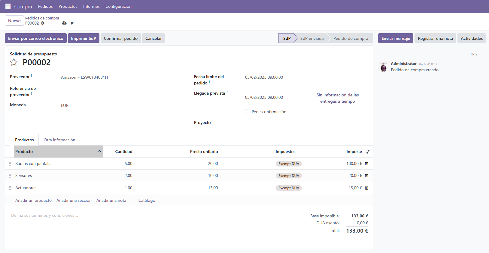
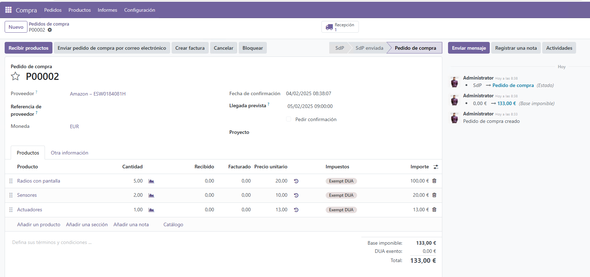

# 🛒 Gestión de una Compra

En esta sección, aprenderás a gestionar **pedidos de compra a proveedores** en **Odoo 18**. Asegúrate de seguir los pasos detallados para registrar y administrar correctamente tus compras.

---

## 🔹 Pasos para registrar una compra

1. Accede al módulo **Compras** desde el panel de control de Odoo.
2. Haz clic en **Crear Pedido de Compra**.
3. Completa los siguientes campos:
   - **Proveedor**: Selecciona el proveedor correspondiente.
   - **Productos**: Agrega los productos que deseas adquirir.
   - **Cantidad**: Indica la cantidad de cada producto.
   - **Precio Unitario**: Revisa y ajusta el precio si es necesario.
   
4. Verifica que toda la información esté correcta.
5. Haz clic en **Confirmar Pedido** para registrar la compra.

---

## 📦 Recepción de mercancía

1. Dirígete a **Recepciones**.
2. Selecciona la orden de recepción vinculada a tu pedido.
3. Verifica los productos y haz clic en **Validar Recepción**.
4. Guarda el registro de la mercancía recibida.

---

## 📊 Reportes de compras

En el módulo **Compras**, puedes generar reportes para obtener un control detallado de todas las operaciones realizadas.