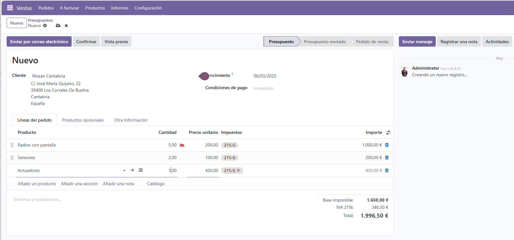
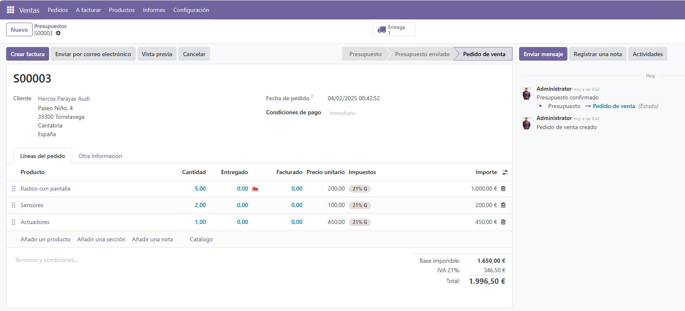
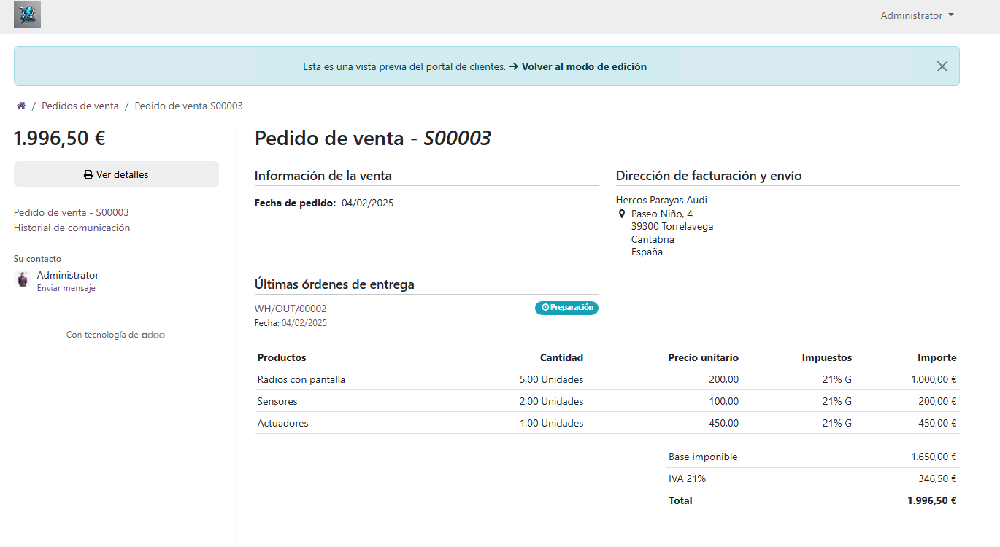

# 🛍️ Gestión de una Venta

En esta sección se detalla el proceso para registrar y gestionar **pedidos de venta** en **Odoo 18**. Sigue estos pasos para asegurar una gestión de ventas eficiente y precisa.

---

## 🔹 Pasos para registrar una venta

1. Ve al módulo **Ventas** desde el panel de control de Odoo.
2. Haz clic en **Crear Pedido de Venta**.
3. Completa los siguientes campos:
   - **Cliente**: Selecciona el cliente al que realizarás la venta.
   - **Productos**: Agrega los productos vendidos.
   - **Cantidad**: Especifica la cantidad de cada producto.
   - **Precio Unitario**: Revisa y ajusta el precio si es necesario.
   
4. Verifica que toda la información esté correcta.
5. Haz clic en **Confirmar Venta** para registrar el pedido.

---

## 🚚 Envío de productos

1. Accede a **Órdenes de Entrega**.
2. Selecciona la orden vinculada a la venta.
3. Verifica los productos y haz clic en **Validar Entrega** para completar el envío.

---

## 💳 Facturación

1. Genera una factura desde el pedido de venta.
2. Revisa toda la información y haz clic en **Validar** para registrar la factura.
3. Descarga o imprime la factura para entregársela al cliente.

---

## 📊 Reportes de ventas

Utiliza el módulo **Ventas** para generar reportes que te permitan analizar el rendimiento y las operaciones de ventas.