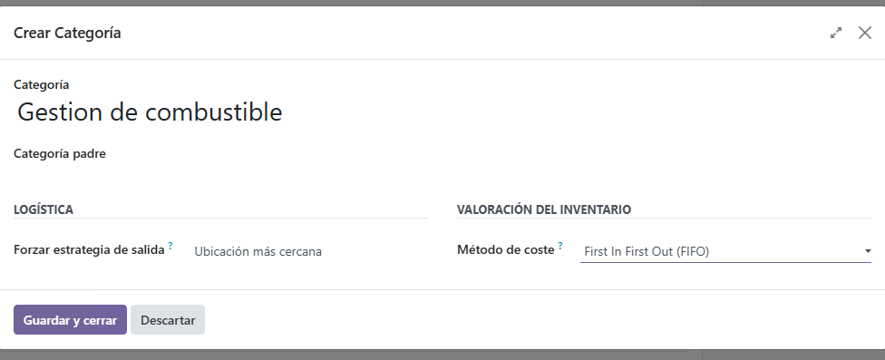
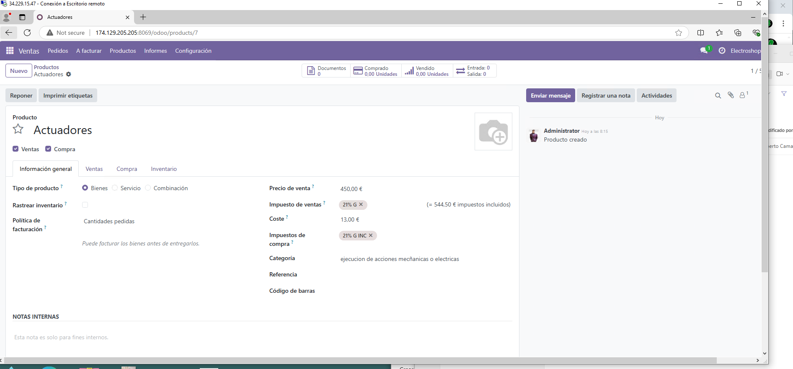
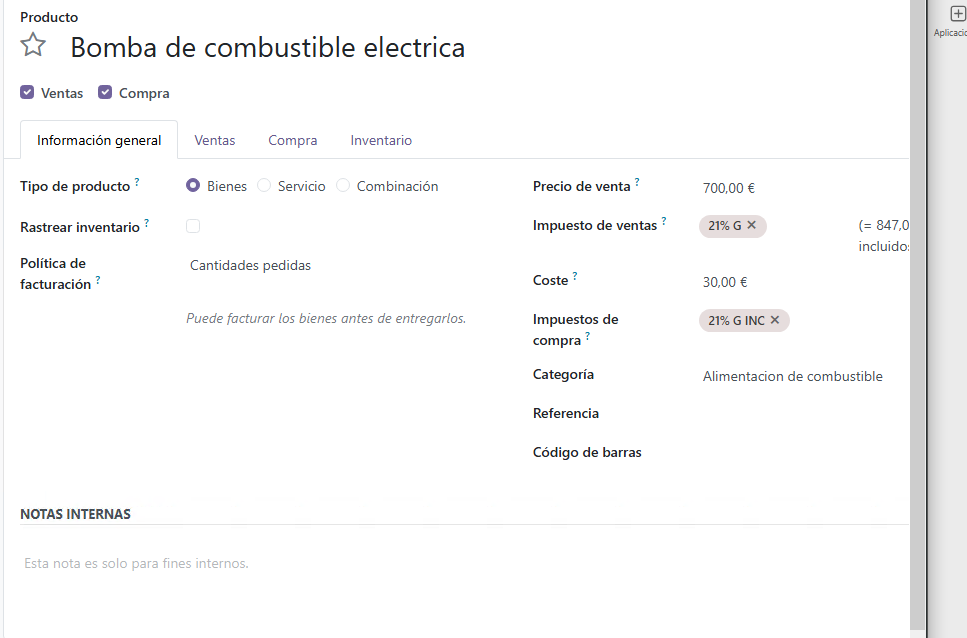
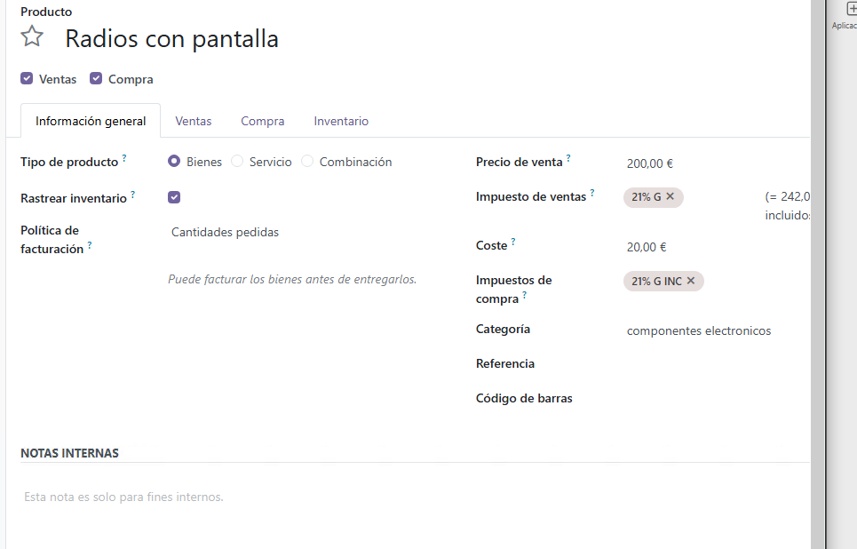
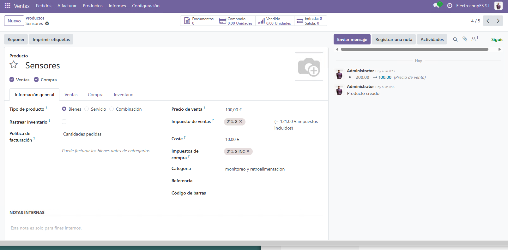
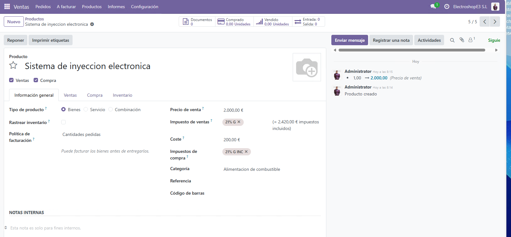
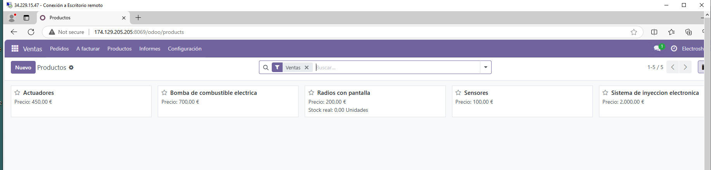

## CREACION DE PRODUCTOS EN ODOO

lo primero que haremos sera crear las categorias para los diferenetes productos que vamos a vender 

# despues de eso, crearemos los diferentes productos y los añadiremos a las categorias correspondientes 

creacion de actuadores 

creacion de el prodcuto bomba de combustible

creacion de radios con pantalla 

creacion de sensores 

creacion de sistema de inyecion electronica

## Por ultimo aqui tendriamos un resumen de todos lo productos y sus precios 

